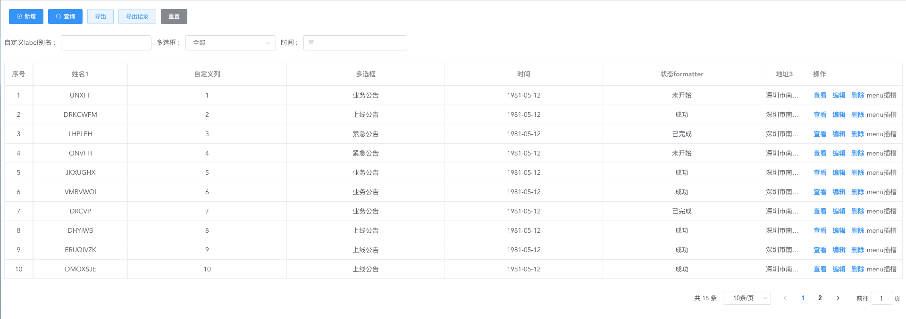
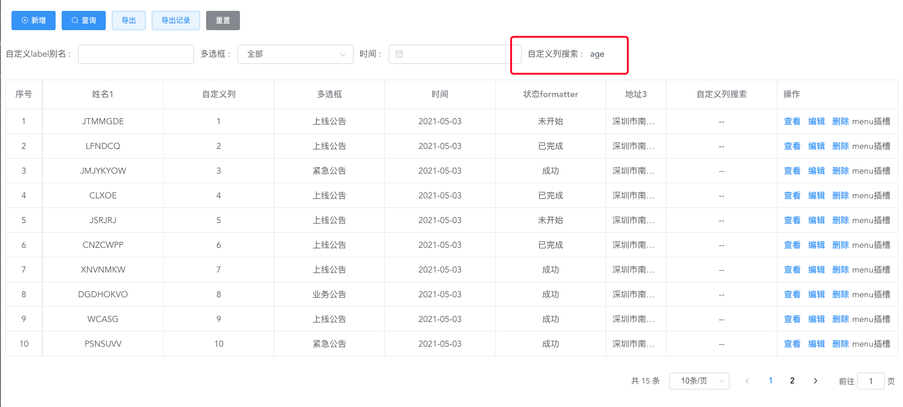
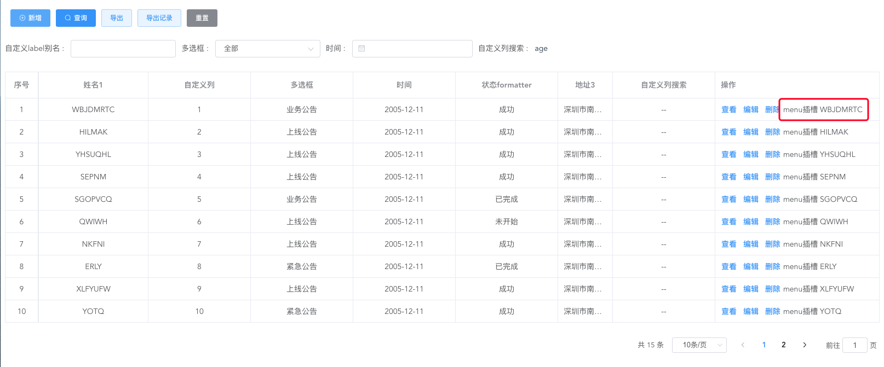

# Vue后台管理系统—— 提升工作效率300%一键配置crud
> 本文主要基于element-ui深度封装，旨在快速完成列表查询、增删改查、弹窗表单。可以看到下面示例1中包含了 Vue2后台管理系统中日常基本功能，代码量却非常少，
可复用性非常高，6点下班美滋滋。

当然，当下功能没有面面俱到，不能完成你工作中的所有场景，如有需要，请留言我会补上你所需的功能场景。我更推荐的是屏幕前的你看懂封装的思路，几年前的我初次使用和浏览时，
直呼666，算是小开了眼界；整个代码量不是很大，逻辑也比较简单，一两把游戏的时间足已；看懂之后增加日常业务开发需求的功能，信手拈来。更推荐将整体完全消化吸收，逐步拓展
成公司组件库，妥妥的KPI，提高整体前端的开发效率，公司小伙伴投来仰慕的目光。
<!-- github地址 不断更新维护 -->
## 一、完整示例


> 包含列表table、分页、搜索条件查询、新增、编辑、删除

``` html
<mx-crud
      :data="tableList"
      :option="listOption"
      :page="page"
      :table-loading="loading"
      @size-change="sizeChange"
      @current-change="currentChange"
      @search-change="searchChange"
      @row-save="addFun"
      @row-update="updateFun"
      @row-del="rowDel"
      @custom-add="rowCustomAdd"
      @custom-view="rowCustomView"
      @custom-edit="rowCustomEdit"
      @search-reset="resetList">
      <template v-slot:zdy="{ row }">
        {{ row.id }}
      </template>
      <template v-slot:menu="{ row }"> menu插槽{{row}} </template>
</mx-crud>
```

```js
listOption() {
      return {
        isShowmenu: true, // 操作栏配置-是否显示操作栏
        isViewBtn: true, // 操作栏配置-是否显示查看
        isEditBtn: true, // 操作栏配置-是否显示编辑
        isDelBtn: true, // 操作栏配置-是否显示删除
        exportBtn: true, // 操作栏配置-导出
        exportRecordBtn: true, // 操作栏配置-导出记录
        align: "center", // 表格列配置-对齐方式
        index: true, // 表格列配置-索引
        customAdd: false, // 自定义新增
        customView: true, // 自定义查看
        customEdit: false, // 自定义编辑
        titleAliasEdit: "自定义title",
        column: [
          {
            label: "姓名1",
            labelAlias: "自定义label别名", // 弹窗表单配置 - 自定义label别名
            prop: "name",
            search: true, // 表格列配置-是否搜索
            width: 200, // 表格列配置-宽度
            rules: {
              required: true,
              message: "请输入",
              trigger: ["blur", "change"],
            },
          },
          {
            label: "自定义列",
            prop: "zdy",
            slot: true, // 表格列配置-自定义列
            viewDisplay: false, // 弹窗表单配置-查看是否显示
            editDisplay: false, // 弹窗表单配置-编辑是否显示
            addDisplay: false, // 弹窗表单配置-新增是否显示
          },
          {
            label: "多选框",
            prop: "selectType",
            // multiple: true,
            search: true,
            type: "select", // 搜索-定义类型
            rules: {
              required: true,
              message: "请选择",
              trigger: ["blur", "change"],
            },
            dicData: [
              {
                label: "紧急公告",
                value: 1,
              },
              {
                label: "上线公告",
                value: 2,
              },
              {
                label: "业务公告",
                value: 3,
              },
            ],
            formatter: (row) => {
              // 表格列配置-筛选
              const map = new Map([
                [1, `紧急公告`],
                [2, `上线公告`],
                [3, `业务公告`],
              ]);
              return map.get(row.selectType);
            },
          },
          {
            label: "时间",
            prop: "date",
            search: true,
            type: "date", // 搜索-定义类型
            format: "yyyy-MM-dd",
            valueFormat: "yyyy-MM-dd",
            rules: {
              required: true,
              message: "请选择",
              trigger: ["blur", "change"],
            },
          },
          {
            label: "状态formatter",
            prop: "status",
            viewDisplay: false, // 弹窗表单配置-查看是否显示
            editDisplay: false, // 弹窗表单配置-编辑是否显示
            addDisplay: false, // 弹窗表单配置-新增是否显示
            formatter: (row) => {
              // 表格列配置-筛选
              const map = new Map([
                [1, `<i class="class1"></i> 未开始`],
                [2, `<i class="class2"></i> 成功`],
                [3, `<i class="class3"></i> 已完成`],
              ]);
              return map.get(row.status);
            },
          },
          {
            label: "列隐藏",
            prop: "lyc",
            viewDisplay: false, // 弹窗表单配置-查看是否显示
            editDisplay: false, // 弹窗表单配置-编辑是否显示
            addDisplay: false, // 弹窗表单配置-新增是否显示
            hide: true, // 表格列配置-列隐藏
          },
          {
            label: "日期2",
            prop: "date2",
            hide: true,
            viewDisplay: false, // 弹窗表单配置-查看是否显示
            editDisplay: false, // 弹窗表单配置-编辑是否显示
            addDisplay: false, // 弹窗表单配置-新增是否显示
            align: "left", // 表格列配置-对齐方式
          },
          {
            label: "地址3",
            prop: "address",
            overHidden: true, // 表格列配置-内容超出隐藏
            width: 100, // 表格列配置-宽度
            rules: {
              required: true,
              message: "请输入",
              trigger: ["blur", "change"],
            },
          },
        ],
      };
    },
```
详情示例见xxx

## 二、属性方法介绍
这些属性方法使用频率较高，方法和属性都是在组件里抛出，当我们需要某些功能和配置
时，添加即可

### Crud
| 参数  | 说 明   | 类型   | 默认值     |
| ------------------------- | ----------------------------------------------------------------------- | --------------- | ---------- |
| data | 列表数据 |  array |  |
| option | 表单配置项 参考Option配置 | object |  |
| page | 分页变量 参考Page参数 |  object |  |
| table-loading | 表格loading|  boolean | boolean |

### Option
| 参数  | 说 明   | 类型   | 默认值     |
| ------------------------- | ----------------------------------------------------------------------- | --------------- | ---------- |
| index | 是否有序号 |  boolean |  |
| align | 列表对齐方式 | string |  'center' |
| isShowmenu | 是否显示操作栏 |  boolean |  false |
| isViewBtn  | 是否显示查看按钮 |  boolean | false |
| isEditBtn  | 是否显示编辑按钮 |  boolean |  false|
| isDelBtn   | 是否显示删除按钮 |  boolean |  false|
| exportBtn  | 是否显示导出按钮 |  boolean |  |
| exportRecordBtn  | 是否显示导出记录按钮 |  boolean |  |
| customAdd  | 是否自定义新增 |  boolean |  |
| customView  | 是否自定义查看 |  boolean |  |
| customEdit  | 是否自定义编辑 |  boolean |  |
| titleAliasEdit  | 自定义新增编辑弹窗title |  string |  |

### Column属性

| 参数  | 说 明   | 类型   | 默认值     |
| ------------------------- | ----------------------------------------------------------------------- | --------------- | ---------- |
| label | 列标题 |  string |  |
| prop  | 列标题对应字段 |  string |  |
| width  | 对应列的宽度  |  string |  |
| search | 是否为搜索项   |  Boolean |  |
| rules | 弹窗表单校验规则   |  object |  |
| hide  | 列表项是否显示   |  Boolean |  |
| addDisplay  | 表单新增时项是否显示   |  Boolean |  |
| editDisplay  | 表单编辑时项是否显示   |  Boolean |  |
| viewDisplay  | 表单查看时项是否显示   |  Boolean |  |
| formatter  | 用来格式化列内容   |  function |  |
| dicData  | 数据字典值   |  array |  |

### Events
| 事件名称  | 说 明   | 类型   | 
| ------------------------- | ----------------------------------------------------------------------- | --------------- | 
| size-change | pageSize 改变时会触发 |  每页条数 |  
| current-change  | currentPage 改变时会触发 |  当前页 |  
| search-change  | 点击搜索触发该事件  |   |  
| search-reset  | 点击重置触发该事件   |   |  
| row-save | 新增数据确定触发该事件   |   |  
| row-update | 更新数据确定触发该事件   |   |  
| row-del  | 行数据删除时触发该事件   |   |  
| custom-add  | 自定义新增触发该事件  |   |  
| custom-edit | 自定义编辑触发该事件    |   |  
| custom-view | 自定义查看触发该事件    |   |  

## 三、搜索 & 分页

### 控制column是否搜索
> search变量控制列表项是否搜索
```js
listOption:{
    column: [{
        label: '姓名',
        prop: 'name',
        search:true, // 控制column是否搜索
    }]
}
```
### 搜索方法
> search-change:点击搜索触发该事件  search-reset: 点击重置触发该事件
```html
<mx-crud
    :data="tableList"
    :option="listOption"
    :page="page"
    :table-loading="loading"
    @search-change="searchChange"
    @search-reset="resetList">
</mx-crud>
```

### 自定义列搜索
> 配置searchslot为true即可开启自定义，列的prop加Search作为卡槽的名称

```html
<mx-crud :option="listOption" :data="tableList" >
     <!-- 搜索 自定义slot -->
      <template v-slot:ageSearch="{ column }"> {{ column.prop }} </template>
</mx-crud>

listOption:{
    column: [{
        label: "自定义列搜索",
        prop: "age",
        search: true,
        searchslot: true,
    }]
}
```


### 页码和条数
> currentPage当前页码，total总条数，pageSize每页多少条数据

## 四、操作栏设置 & 表格列配置

### 操作栏隐藏 & 其他属性
> isShowmenu属性接受一个Boolean的属性达到隐藏操作栏的效果，默认为false
> menuWidth属性设置操作栏宽度

### 自定义操作栏
> menu为操作栏自定义
```html
<!-- 操作栏配置-自定义操作栏 -->
 <template #menu="{ row }"> menu插槽 {{ row.name }}</template>
```


### 操作栏查看、编辑、删除按钮设置
> isViewBtn是否显示查看按钮,默认false;
> isEditBtn是否显示编辑按钮,默认false;
> isDelBtn 是否显示删除按钮,默认false;


## 五、按钮自定义 & 增删改查

## 六、配置接口

## 七、Mixins


